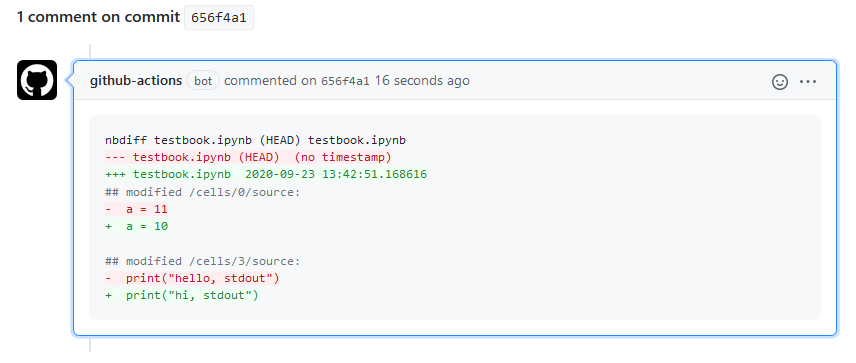

-----------------

# jupydiff Docker Action for GitHub Actions
**jupydiff** is a GitHub Action that allows data scientists to quickly compare changes made to Jupyter notebooks in GitHub repositories. It works with regular commits and pull requests. When a change is made, **jupydiff** computes the code additions and deletions within each notebook, and summarises these as a comment on the associated commit or pull request.

<div align="center">
  
</div>

## Table of contents
* [Why use jupydiff](#Why-use-jupydiff)
* [How to use jupydiff](#How-to-use-jupydiff)
* [Dependencies](#Dependencies)
* [License](#License)
* [Contributors](#Contributors)

## Why use jupydiff
**jupydiff** helps you streamline data science code reviews. Without **jupydiff**, to compute the exact code difference between two Jupyter notebooks a reviewer would need to clone the repository, download and install [nbdime](https://github.com/jupyter/nbdime) and then run `nbdime diff` on the command line. Alternatively, observing the regular diff in a code editor, version control tool or on GitHub itself involved interpreting lines of underlying JSON Jupyter notebook structure.

## How to use jupydiff
**jupydiff** is a GitHub action. This means it can be used in any GitHub repostitory (public or private) by configuring a [GitHub Action workflow](https://docs.github.com/en/free-pro-team@latest/actions/reference/workflow-syntax-for-github-actions) in your repository.

See below for an example workflow that runs **jupydiff** on any commit made to the repository. Comments on commits will be automatically added to relevant pull requests.

```yaml
name: jupydiff

on: [ push ]

jobs:
  build:
    runs-on: ubuntu-latest
    steps:
      - uses: actions/checkout@v2
        with:
          fetch-depth: 2
      - uses: Faethm-ai/jupydiff@v1
```

To configure **jupydiff** in your repostiory, add a the YAML above to a file at `.github/workflows/jupydiff.yml`.

Important notes:
* The GitHub checkout action (`action/checkout`) is required to populate the GitHub Action runner with the repostiory contents. `fetch-depth: 2` fetches the current and previous commits which are required for nbdime to compute the diff.
* All of **jupydiff**'s magic is contained in a single Docker action, which is added as a step by referencing `Faethm-ai/jupydiff@v1` in your workflow.
* When a push is made or a pull request is opened in your repository, this workflow will leave a comment with any differences in the Jupyter notebooks. This may take up to 2 minutes.

## Dependencies
**jupydiff** is based on nbdime and builds on the official Python Docker image. It also requires nodejs and the official GitHub npm modules to leave a comment. 

## License
**jupydiff** is licensed under the [MIT license](LICENSE).

## Contributors
**jupydiff** has been developed and used by data scientists and engineers at [Faethm AI](https://faethm.ai). The original project was authored by [Mikhail Thornhill](https://github.com/MikhailTH) and [Blair Hudson](https://github.com/blairhudson).
